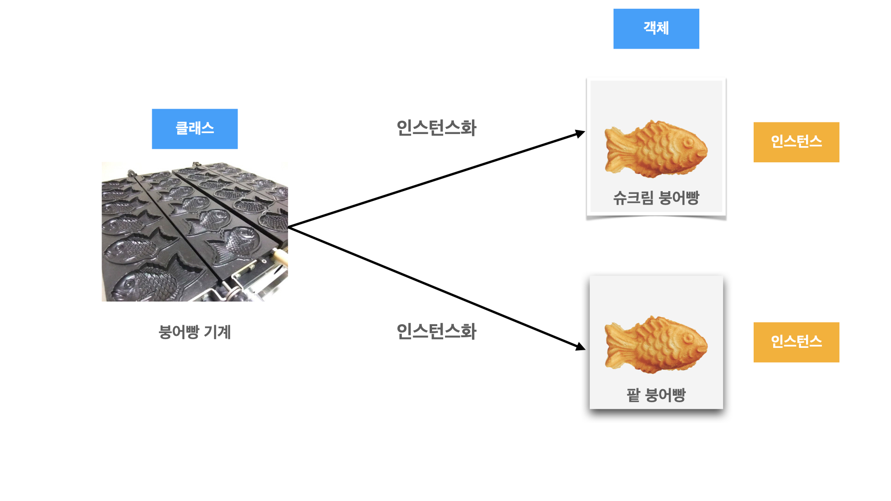

# ☕ Java 클래스와 객체
클래스와 객체의 관계는 제품 설계도와 제품과의 관계로 비유할 수 있다.


붕어빵 기계로 슈크림 붕어빵과 팥 붕어빵을 만들었다. 이 과정을 __클래스의 인스턴스화__ 라고 하며 만들어진 슈크림 붕어빵을 __인스턴스__ 라고 한다.   

객체와 인스턴스는 같은 의미이지만, 객체는 모든 인스턴스를 대표하는 포괄적인 의미를 갖고있으며 인스턴스는 어떤 클래스로부터 만들어진 것인지를 강조하는 보다 구체적인 의미를 갖고있다.

## 📌 객체지향 프로그래밍 (Object Oriented Programming, OOP)
객체지향언어는 코드 간에 서로 관계를 맺어 줌으로써 유기적으로 프로그램을 구성하는 것이다.

### 💡 특징
1. 코드의 재사용성이 높다.
2. 코드의 관리(유지보수)가 용이하다.
3. 신뢰성이 높은 프로그래밍을 가능하게 한다.   
    * 가장 큰 장점 : 코드의 재사용성이 높고 유지보수가 용이하다. 

## 📌 클래스 정의(선언)
클래스를 만들려면 클래스 이름이 필요하다. 관례적으로 클래스 이름은 각 단어 첫 글자를 대문자로 시작하여 나머지는 소문자로 작성한다.   
```java
Person      // (o)
2Person     // (x) 처음에 숫자가 올 수 없다.
@person!    // (x) '$', '_' 외의 특수 문자는 사용 불가능
int(x), for(x)  // (x) 자바 키워드(예약어)는 사용할 수 없다.
```
```java
접근제어자 class 클래스명 {

}

public class Person {

}
```
Person.java 라는 클래스 파일을 생성하고 위와 같이 작성할 수 있다.
```java
public class Person {
    // 필드
    int age;
    String name;

    // 생성자
    Person() {...}

    // 메소드
    void eat() {...}
}
```
클래스의 구성 멤버로는 필드, 생성자, 메소드가 존재한다.
## ✨ 필드
* 객체의 고유 데이터, 상태 정보를 저장하는 곳
* 생성자와 메소드 전체에서 사용되며 객체가 소멸되지 않는 한 객체와 함께 존재
* 초기화 하지 않으면 각 자료형의 기본값으로 초기화 됨
* 필드 선언   
    * 생성자 선언과 메소드 선언의 앞 뒤 어떤 곳에서도 필드 선언 가능
    * 단, 생성자와 메소드 내부에서는 선언될 수 없음 (생성자, 메소드 내부의 변수는 지역변수)
* 필드 사용
    * 필드 값을 읽고 변경하는 작업
    * 클래스 내부에서는 단순히 필드 이름으로 읽고 변경
    * 클래스 외부에서는 클래스로부터 객체 생성 후 사용 (일반적으로 직접 접근 못하게 캡슐화)

## ✨ 생성자
* new 연산자로 호출되는 특별한 {} 블록
* 객체 생성 시 초기화 담당
* 필드를 초기화하거나 메소드를 호출해서 객체를 사용할 준비
* 클래스 이름으로 되어 있고 리턴 타입이 없다
* 생성자 선언   
    * 생성자를 선언 안해도 기본적으로 컴파일시 디폴트 생성자가 생성됨
    * 생성자는 메소드와 비슷한 모양을 가지나, 리턴 타잆이 없고 클래스 이름과 동일
    * 클래스에 생성자가 명시적으로 선언되어 있을 경우 반드시 선언된 생성자를 호출해서 객체를 생성
    * 하나라도 인자값을 가진 다른 생성자를 호출할 경우 디폴트 생성자는 자동으로 생성되지 않으므로 디폴트 생성자를 호출하기 위해선 디폴트 생성자도 명시적으로 선언해줘야 함
* 필드 초기화
    * 필드를 선언할 때 초기값을 주면 동일한 클래스로부터 생성되는 객체들은 모두 같은 데이터를 가짐
    * 객체 생성 시점에 외부에서 제공되는 다양한 값들로 초기화 되어야 한다면 생성자에서 초기화 해야 함
* 관례적으로 필드와 동일한 이름을 갖는 매개변수 사용
    * 이 경우 필드와 매개변수 이름이 동일하므로 생성자 내부에서 해당 필드에 접근할 수 없다
    * why? 동일한 이름의 매개변수가 사용 우선순위가 높다. 따라서 __this__ 를 사용한다.
    * this는 객체 자신의 참조

```java
public class Cat {
	private String name;
	public setName(String name) {
		// 필드 name과 매개변수 name의 이름이 같다
		// name = name
		this.name = name
	}
	
}
```
* 생성자 오버로딩
    * 매개변수를 달리하는 생성자를 여러 개 선언하는 것
    * 오버로딩 시 주의점은 매개변수의 타입과 개수 그리고 선언된 순서가 똑같을 경우 매개변수 이름만 바꾸는 것은 오버로딩이라고 볼 수 없음
* 다른 생성자 호출(this())
    * 생성자 오버로딩이 많아질 경우 생성자 간의 중복된 코드 발생
    * 이 경우 필드 초기화한 내용은 한 생성자에만 집중적으로 작성하고 나머지 생성자는 초기화 내용을 가지고 있는 생성자를 호출하는 방법으로 개선
    * 생성자에서 다른 생성자 호출할 때 this()코드 사용
    * this()는 자신의 다른 생성자를 호출하는 코드, 반드시 생성자 첫 줄에서만 허용

```java
public Cat(String name, String breed) {
        this.name = name;
        this.breed = breed;
}

public Cat(String name, String breed, int age) {
        this(name, breed);
        this.age = age;
}
```

## ✨ 메소드
* 객체의 동작에 해당하는 {} 블록
* 메소드 호출 => {} 블록 내 모든 코드 실행
* 용도
    * 필드 읽고 수정
    * 다른 객체 생성해서 다양한 기능 수행
    * 객체 간의 데이터 전달 수단
    * 이외 다양한 행동 구현
* 메소드 선언
```java
[접근제한자] [기타제어자] 반환자료형 메서드명(매개변수) {
    [return 리턴값;]
}
```
* 메소드 선언부 = 메소드 시그니처
* 리턴 타입
    * 메소드가 실행 후 리턴하는 값의 타입
    * 메소드 실행 후 결과를 호출한 곳에 넘겨줄 경우에는 리턴 값이 있어야 함
    * 리턴 값의 타입은 선언부의 반환자료형과 동일해야함
    * 리턴 타입이 있다고 해서 반드시 리턴값을 변수에 저장할 필요 없음
    * void 타입의 경우 return문 없이 사용 가능
* 매개변수의 수를 모를 경우
    * 매개변수를 배열 타입으로 선언
    * ...으로 선언 후 리스트 나열
```java
public int sum(int ... args) {
        return IntStream.of(args).sum();
}
```
* 메소드 호출
* 메소드는 클래스 내/외부의 호출에 의해 실행
    * 클래스 외부에서 호출할 경우 우선 클래스로부터 객체 생성
    * 클래스 참조변수 = new 클래스(매개값); 참조변수.메소드(매개값); (리턴값 없거나, 받지 않을 경우) 타입 변수 = 참조변수.메소드(매개값); (리턴값 받고 싶을 때)
* 메소드 오버로딩
    * 클래스 내에 같은 이름의 메소드를여러 개 선언하는 것
    * 매개 변수의 타입, 개수, 순서 중 하나가 달라야 한다(시그니처가 달라야 한다)

## 📌 객체 만드는 방법(new 키워드 이해하기)
```java
클래스명 변수명;    // 클래스의 객체를 참조하기 위한 참조변수 선언
변수명 = new 클래스명();    // 클래스의 객체를 생성 후, 객체의 주소를 참조변수에 저장

Tv t;   // Tv 클래스 타입의 참조변수 t 선언
t = new Tv();   // TV 인스턴스를 생성 후, 생성된 Tv 인스턴스의 주소를 t에 저장

Tv t = new Tv();    // 한 줄로 줄여서 사용
```

## 📌 메소드 정의하는 방법
### 메소드를 사용하는 이유
* 높은 재사용성
* 중복된 코드 제거
* 프로그램의 구조화

### ✨ 선언부
```java
반환타입(출력) 메소드이름 매개변수선언(입력)

int add (int x, int y) { ... }
```
* 매개변수 선언 x, y 두 개의 정수를 입력받아서, 두 값을 더한 결과(int 타입)을 반환한다. 값을 입력받을 필요가 없다면 () 빈괄호를 작성한다.
> 매개변수도 메소드 내에 선언된 것이므로 '지역변수'이다.
* 메소드 이름 변수의 명명규칙대로 작성. 주로 동사인 경우가 많다 (특정 작업을 수행하므로), 이름만으로도 메서드의 기능을 쉽게 알 수 있도록 함축적이면서 의미있는 이름을 짓도록 신중해야함.
* 반환타입 메소드의 작업 수행 결과 반환할 타입을 적는다. 반환 값이 없을 경우 'void'로 작성

### ✨ 구현부
```
선언부 다음에 오는 괄호 {}, 메소드를 호출했을 때 수행될 문장들을 작성.
```
* return문 반환타입이 'void'가 아닌 경우에 구현부 안에 반드시 return 반환값;이 포함되어야 한다. 반환타입과 일치하거나 자동 형변환이 가능한 타입이어야 한다.
* 지역변수(local variable) 메소드 내에 선언된 변수들은 그 메서드 내에서만 사용가능하다. 즉, 서로 다른 메소드라면 같은 이름의 변수를 선언해도 상관없다.

### ✨ 메소드 호출
메서드를 정의 하고 호출하지 않으면 아무런 일이 일어나지 않는다. 메소드를 호출해야만 구현부 {} 안의 문장들이 수행된다.
```java
메소드이름(값1, 값2, ...);

// 1
print();

// 2
int result = add(10, 20);
```
__인자(argument)와 매개변수(parameter)__   

메소드를 호출 할 때 괄호 () 안에 지정한 값들을 인자(argument)라고 한다. 인자의 개수와 순서는 호출된 메소드에 선언된 매개변수(parameter)와 일치해야 한다.

__return 문__    
> 현재 실행 중인 메소드를 종료하고 호출한 메소드로 되돌아간다.
    
모든 메소드에는 적어도 하나의 return문이 있어야 한다. 반환값이 void인 경우에는 컴파일러가 메서드의 마지막에 return을 자동적으로 추가해준다.
```java
void printHello () {
    System.out.println("hello");
    return;     // 생략가능. 컴파일러가 자동 추가
}
```
💡 하지만, void가 아니라면 반드시 return문을 작성해주어야 한다.

__클래스 메소드(static 메소드)와 인스턴스 메소드__   
* 인스턴스 메소드는 인스턴스 변수와 관련된 작업을 하는, 즉 메소드의 작업을 수행하는데 인스턴스 변수를 필요로 하는 메서드이다.
* 인스턴스와 관계없는 (인스턴스 변수나 인스턴스 메소드를 사용하지 않는) 메소드를 클래스 메소드(static 메소드)로 정의한다.

인스턴스 변수를 사용하지 않는다고 해서 반드시 클래스 메소드로 정의해야하는 것은 아니지만 특별한 이유가 없는 한 그렇게 하는 것이 일반적이다.
1. 클래스 설계 시, 멤버변수 중 모든 인스턴스에서 공통으로 사용하는 것에 static 추가
2. 클래스 변수(static 변수)는 인스턴스를 생성하지 않아도 사용 가능
3. 클래스 메소드(static 메소드)는 인스턴스 변수를 사용할 수 없음
4. 메소드 내에서 인스턴스 변수를 사용하지 않는다면, static을 붙이는 것을 고려

__오버로딩(Overloading)__
> 한 클래스 내에 같은 이름의 메소드를 여러 개 정의
>1. 메소드 이름이 같아야 한다.
>2. 매개변수의 개수 또는 타입이 달라야 한다.

반환 타입은 오버로딩을 구현하는데 아무런 영향을 주지 못한다.
```java
void println()
void println(boolean x)
void println(char x)
void println(int x)
...
```
println 메소드의 오버로딩 예시이다.

## 📌 접근 제한자
* public : 모든 클래스의 접근을 허용
* protected : 동일 패키지 또는 상속 관계가 있는 클래스의 접근 허용
* default: 동일 패키지(폴더)에 존재하는 클래스의 접근 허용
* private : 모든 클래스의 접근을 거부

## 📌 접근자와 설정자
클래스 내부에 캡슐화된 멤버를 외부에서 사용할 때 필요하다.       
### ✨ 접근자 
private 필드를 외부로 반환하는 public 메소드 이며 get + 필드명 형태로 작성한다. 반환타입은 대상 필드와 같다.   
### ✨ 설정자 
private 필드를 외부에서 변경하게 하는 public 메소드 이며 set + 필드명 형태로 작성한다. 반환 타입은 void.

## 📌 생성자 정의하는 방법
> 인스턴스가 생성될 때 호출되는 '인스턴스 초기화 메소드'이다.

생성자의 조건은 다음과 같다.    
1. 생성자의 이름은 클래스의 이름과 같아야 한다.
2. 생성자는 리턴 값이 없다.
```java
class Card {

  Card() {  // 매개변수가 없는 생성자
    ...   
  }

  Card(String k, int num) {   // 매개변수가 있는 생성자
    ...       
  }
}
```
__❗️ 기본 생성자가 컴파일러에 의해서 추가되는 경우는 클래스에 정의된 생성자가 하나도 없을 때 뿐이다.__

## 📌 this 키워드 이해하기   
>this : 인스턴스 자신을 가리키는 참조변수, 인스턴스의 주소가 저장되어있다. 모든 인스턴스 메소드에 지역변수로 숨겨진 채로 존재   
> this(), this(매개변수) : 생성자. 같은 클래스의 다른 생성자를 호출할 때 사용

__this(), this(매개변수)__
```java
Car(String color) {
  door = 5;
  Car(collor, "auto", 4);   // Error.
}
```
위의 코드는 에러가 발생하는데    
1. 생성자의 두 번째 줄에서 다른 생성자 호출
2. this(color, "auto", 4);로 호출해야함  

위 두가지 조건에 만족하지 못했기 때문이다.    

__this__
아래는 위에서 정의한 매개변수 있는 생성자인데 만약 매개변수로 선언된 변수의 이름이 인스턴스 변수와 같을 때에도 this를 사용한다.
```java
Car(String color, String gearType, int door) {
  this.color = color;
  this.gearType = gearType;
  this.door = door;
}
```
이유는 color = color; 라고 하면 두 값이 구분되지 않으므로, this.color = color;라고 작성하면 this 키워드로 인해 인스턴스 변수의 color 라고 알 수 있기 때문이다.

당연한 말이지만, static메소드(클래스 메소드)에서는 인스턴스 멤버들을 사용할 수 없는것처럼 this 역시 사용할 수 없다.

